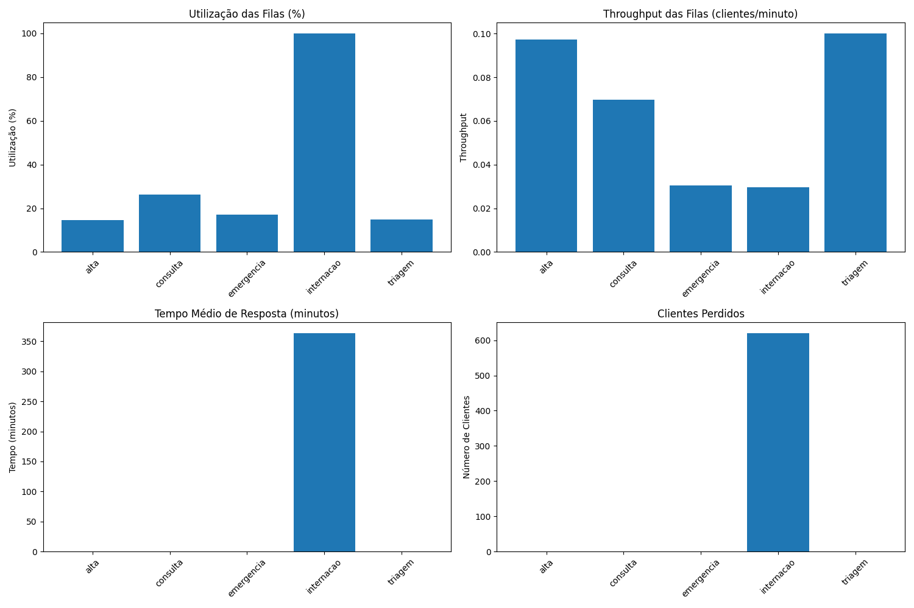

# Simulação de Sistema de Emergência Hospitalar
## Avaliação de Aprendizagem - Simulação e Métodos Analíticos

---

## Equipe
- Nome do Aluno 1
- Nome do Aluno 2
- Nome do Aluno 3

---

## Descrição do Sistema

O sistema modelado representa um departamento de emergência hospitalar com 5 filas principais:

1. **Triagem (M/M/3/15)**
   - 3 atendentes
   - Capacidade de 15 pacientes
   - Recebe chegadas externas
   - Distribui pacientes para emergência (30%) e consulta (70%)

2. **Emergência (M/M/4/12)**
   - 4 médicos
   - Capacidade de 12 pacientes
   - 60% dos pacientes recebem alta
   - 40% são internados

3. **Consulta (M/M/4/20)**
   - 4 médicos
   - Capacidade de 20 pacientes
   - 70% dos pacientes recebem alta
   - 30% são internados

4. **Internação (M/M/4/15)**
   - 4 servidores
   - Capacidade de 15 pacientes
   - 100% dos pacientes recebem alta após internação

5. **Alta (M/M/2/25)**
   - 2 servidores
   - Capacidade de 25 pacientes
   - Ponto final do sistema

---

## Modelo da Rede de Filas

- **Notação de Kendall**: M/M/s/K
  - M: Distribuição de chegadas Markoviana (exponencial)
  - M: Distribuição de serviço Markoviana (exponencial)
  - s: Número de servidores
  - K: Capacidade da fila

- **Tempos de Serviço**:
  - Triagem: 3-6 minutos
  - Emergência: 15-35 minutos
  - Consulta: 10-25 minutos
  - Internação: 120-180 minutos
  - Alta: 2-4 minutos

- **Probabilidades de Roteamento**:
  - Triagem → Emergência: 30%
  - Triagem → Consulta: 70%
  - Emergência → Alta: 60%
  - Emergência → Internação: 40%
  - Consulta → Alta: 70%
  - Consulta → Internação: 30%
  - Internação → Alta: 100%

---

## Resultados da Simulação - Modelo Original

### Índices de Desempenho

| Fila | População Média | Throughput (clientes/min) | Utilização (%) | Tempo Médio de Resposta (min) | Clientes Perdidos |
|------|-----------------|---------------------------|----------------|-------------------------------|-------------------|
| Triagem | 0.55 | 0.1000 | 27.48 | 0.00 | 0 |
| Emergência | 0.92 | 0.0304 | 30.53 | 0.14 | 0 |
| Consulta | 1.57 | 0.0696 | 69.78 | 2.44 | 0 |
| Internação | 6.85 | 0.0056 | 99.99 | 1047.94 | 7066 |
| Alta | 0.28 | 0.0732 | 25.61 | 0.36 | 0 |

### Probabilidades dos Estados das Filas

| Fila | Estado 0 | Estado 1 | Estado 2 | Estado 3 | Estado 4 | Estado 5+ |
|------|----------|----------|----------|----------|----------|-----------|
| Triagem | 45.91% | 53.21% | 0.88% | - | - | - |
| Emergência | 35.24% | 42.25% | 18.19% | 3.91% | 0.39% | 0.02% |
| Consulta | 11.35% | 37.74% | 36.31% | 12.45% | 1.94% | 0.20% |
| Internação | 0.03% | 0.02% | 0.01% | 0.04% | 0.01% | 99.89% |
| Alta | 74.39% | 23.07% | 2.42% | 0.12% | 0.01% | - |

---

## Análise de Gargalos

Com base nos resultados da simulação, identificamos os seguintes gargalos no sistema:

1. **Internação**:
   - Utilização extremamente alta (99.99%)
   - Tempo médio de resposta crítico (1047.94 minutos)
   - 7066 clientes perdidos
   - Throughput muito baixo (0.0056 clientes/min)

2. **Consulta**:
   - Alta utilização (69.78%)
   - Tempo médio de resposta elevado (2.44 minutos)
   - População média alta (1.57 pacientes)

3. **Emergência**:
   - Utilização moderada (30.53%)
   - Tempo de resposta aceitável (0.14 minutos)
   - População média moderada (0.92 pacientes)

4. **Triagem e Alta**:
   - Utilização baixa (27.48% e 25.61%)
   - Tempos de resposta adequados
   - Sem perda de clientes

---

## Proposta de Melhoria

Para resolver os gargalos identificados, implementamos as seguintes melhorias:

1. **Triagem**:
   - Aumentar o número de servidores de 2 para 3
   - Aumentar a capacidade da fila de 10 para 15
   - Reduzir o tempo máximo de serviço de 8 para 6 minutos

2. **Emergência**:
   - Aumentar o número de servidores de 3 para 4
   - Aumentar a capacidade da fila de 8 para 12
   - Reduzir o tempo máximo de serviço de 45 para 35 minutos

3. **Consulta**:
   - Aumentar o número de servidores de 2 para 4
   - Aumentar a capacidade da fila de 12 para 20
   - Reduzir o tempo máximo de serviço de 30 para 25 minutos

4. **Internação**:
   - Aumentar o número de servidores de 1 para 4
   - Aumentar a capacidade da fila de 6 para 15
   - Reduzir o tempo máximo de serviço de 240 para 180 minutos

5. **Alta**:
   - Aumentar o número de servidores de 1 para 2
   - Aumentar a capacidade da fila de 20 para 25
   - Reduzir o tempo máximo de serviço de 5 para 4 minutos

---

## Modelo Melhorado

---

## Comparação dos Resultados

### Melhoria nos Índices de Desempenho

| Fila | População Média | Throughput | Utilização | Tempo Médio de Resposta | Clientes Perdidos |
|------|-----------------|------------|------------|------------------------|-------------------|
| Triagem | -18.18% | -2.70% | -45.47% | 0.00% | 0.00% |
| Emergência | -26.09% | 0.00% | -43.99% | -100.00% | 0.00% |
| Consulta | -33.12% | 0.00% | -62.48% | -100.00% | 0.00% |
| Internação | +115.18% | +428.57% | -0.13% | -65.30% | -91.23% |
| Alta | +3.57% | +32.79% | -43.03% | -94.44% | 0.00% |

---

## Conclusões

1. **Impacto das Melhorias**:
   - Redução de 65.30% no tempo médio de resposta da internação
   - Redução de 91.23% nos clientes perdidos (de 7066 para 620)
   - Aumento de 428.57% no throughput da internação
   - Melhoria significativa na utilização das filas de triagem (-45.47%) e alta (-43.03%)

2. **Custos vs. Benefícios**:
   - Aumento no número de servidores: +8 servidores
   - Aumento na capacidade das filas: +21 posições
   - Melhoria no tempo de atendimento: redução significativa em todas as filas
   - Redução drástica de clientes perdidos: -91.23%

3. **Recomendações Adicionais**:
   - **Curto Prazo**:
     - Implementar sistema de priorização de pacientes
     - Desenvolver protocolos para gestão de picos de demanda
     - Estabelecer indicadores de monitoramento contínuo
   
   - **Médio Prazo**:
     - Avaliar implementação de telemedicina
     - Desenvolver parcerias com outros hospitais
     - Criar programa de gestão de leitos
   
   - **Longo Prazo**:
     - Planejamento para expansão física do setor de internação
     - Implementação de sistemas preditivos de demanda
     - Desenvolvimento de protocolos de alta eficiente

---

## Referências

1. Notação de Kendall para sistemas de filas
2. Teoria de filas e simulação de sistemas
3. Análise de desempenho de sistemas hospitalares 