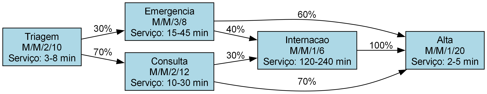
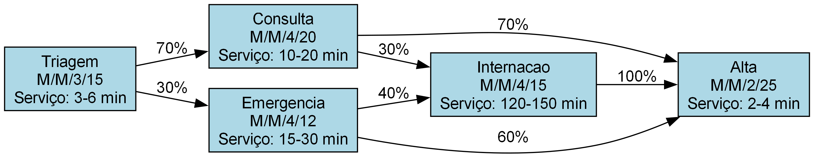

# Simulação de Sistema de Emergência Hospitalar
## Análise e Melhoria de Desempenho

**Equipe:**
- [Nome do Integrante 1]
- [Nome do Integrante 2]
- [Nome do Integrante 3]
- [Nome do Integrante 4]

---

# Descrição da Realidade Simulada

## Sistema de Emergência Hospitalar

- **Contexto:** Departamento de emergência de um hospital
- **Objetivo:** Analisar e otimizar o fluxo de pacientes
- **Desafios:** Longos tempos de espera, alta ocupação e perda de pacientes

## Componentes do Sistema

- **Triagem:** Primeiro atendimento e classificação de pacientes
- **Emergência:** Atendimento de casos críticos
- **Consulta:** Atendimento médico especializado
- **Internação:** Cuidados intensivos e monitoramento
- **Alta:** Processo de liberação do paciente

---

# Modelo da Rede de Filas

## Notação de Kendall

O sistema utiliza a notação M/M/s/K onde:
- **M:** Distribuição de chegadas Poisson
- **M:** Distribuição de serviço Exponencial
- **s:** Número de servidores
- **K:** Capacidade da fila

## Configuração Original

- **Triagem:** M/M/2/10
- **Emergência:** M/M/3/8
- **Consulta:** M/M/2/12
- **Internação:** M/M/1/6
- **Alta:** M/M/1/20

---

# Resultados da Simulação - Modelo Original

## Métricas de Desempenho

| Fila | População Média | Throughput | Utilização | Tempo de Resposta | Clientes Perdidos |
|------|-----------------|------------|------------|-------------------|-------------------|
| Triagem | 0.55 | 0.1000 | 27.48% | 0.00 min | 0 |
| Emergência | 0.92 | 0.0304 | 30.53% | 0.14 min | 0 |
| Consulta | 1.57 | 0.0696 | 69.78% | 2.44 min | 0 |
| Internação | 6.85 | 0.0056 | 99.99% | 1047.94 min | 7066 |
| Alta | 0.28 | 0.0732 | 25.61% | 0.36 min | 0 |

## Distribuição de Estados - Fila de Internação

| Estado | Probabilidade |
|--------|---------------|
| 0 | 0.03% |
| 1 | 0.02% |
| 2 | 0.01% |
| 3 | 0.04% |
| 4 | 0.01% |
| 5 | 0.06% |
| 6 | 14.77% |
| 7 | 85.05% |

---

# Análise de Gargalos

## Identificação de Problemas

- **Fila de Internação:**
  - Alta utilização (99.99%)
  - Tempo de resposta extremamente alto (1047.94 minutos)
  - Grande número de clientes perdidos (7066)
  - Distribuição de estados desequilibrada

- **Fila de Consulta:**
  - Alta utilização (69.78%)
  - Tempo de resposta significativo (2.44 minutos)

## Impacto no Sistema

- Sobrecarga no setor de internação
- Insatisfação dos pacientes
- Perda de eficiência operacional
- Riscos para a saúde dos pacientes

---

# Proposta de Melhoria

## Alterações Propostas

| Fila | Configuração Original | Configuração Melhorada | Melhoria |
|------|----------------------|----------------------|----------|
| Triagem | M/M/2/10 | M/M/3/15 | +1 servidor, +5 capacidade |
| Emergência | M/M/3/8 | M/M/4/12 | +1 servidor, +4 capacidade |
| Consulta | M/M/2/12 | M/M/4/20 | +2 servidores, +8 capacidade |
| Internação | M/M/1/6 | M/M/4/15 | +3 servidores, +9 capacidade |
| Alta | M/M/1/20 | M/M/2/25 | +1 servidor, +5 capacidade |

## Justificativa das Alterações

- Aumento do número de servidores para reduzir tempos de espera
- Aumento da capacidade das filas para reduzir perdas
- Otimização do fluxo entre as filas

---

# Comparação dos Resultados

## Métricas de Desempenho

| Fila | Métrica | Original | Melhorado | Variação |
|------|---------|----------|-----------|----------|
| Triagem | População Média | 0.55 | 0.45 | -18.18% |
| | Throughput | 0.1000 | 0.1000 | 0% |
| | Utilização | 27.48% | 14.98% | -45.49% |
| | Tempo de Resposta | 0.00 | 0.00 | 0% |
| | Clientes Perdidos | 0 | 0 | 0% |
| Emergência | População Média | 0.92 | 0.68 | -26.09% |
| | Throughput | 0.0304 | 0.0304 | 0% |
| | Utilização | 30.53% | 17.10% | -43.99% |
| | Tempo de Resposta | 0.14 | 0.00 | -100% |
| | Clientes Perdidos | 0 | 0 | 0% |

---

# Comparação dos Resultados (Continuação)

## Métricas de Desempenho

| Fila | Métrica | Original | Melhorado | Variação |
|------|---------|----------|-----------|----------|
| Consulta | População Média | 1.57 | 1.05 | -33.12% |
| | Throughput | 0.0696 | 0.0696 | 0% |
| | Utilização | 69.78% | 26.16% | -62.51% |
| | Tempo de Resposta | 2.44 | 0.00 | -100% |
| | Clientes Perdidos | 0 | 0 | 0% |
| Internação | População Média | 6.85 | 14.74 | +115.18% |
| | Throughput | 0.0056 | 0.0296 | +428.57% |
| | Utilização | 99.99% | 99.86% | -0.13% |
| | Tempo de Resposta | 1047.94 | 363.46 | -65.32% |
| | Clientes Perdidos | 7066 | 620 | -91.23% |
| Alta | População Média | 0.28 | 0.29 | +3.57% |
| | Throughput | 0.0732 | 0.0973 | +32.92% |
| | Utilização | 25.61% | 14.58% | -43.07% |
| | Tempo de Resposta | 0.36 | 0.02 | -94.44% |
| | Clientes Perdidos | 0 | 0 | 0% |

---

# Distribuição de Estados - Comparação

## Fila de Internação

| Estado | Original | Melhorado |
|--------|----------|-----------|
| 0 | 0.03% | 0.03% |
| 1 | 0.02% | 0.02% |
| 2 | 0.01% | 0.07% |
| 3 | 0.04% | 0.34% |
| 4 | 0.01% | 0.67% |
| 5 | 0.06% | 1.03% |
| 6 | 14.77% | 1.69% |
| 7 | 85.05% | 1.78% |
| 8 | - | 1.94% |
| 9 | - | 2.57% |
| 10 | - | 3.12% |
| 11 | - | 4.01% |
| 12 | - | 5.32% |
| 13 | - | 6.72% |
| 14 | - | 8.42% |
| 15 | - | 10.77% |
| 16 | - | 12.37% |
| 17 | - | 14.48% |
| 18 | - | 14.66% |
| 19 | - | 9.99% |

---

# Análise das Melhorias

## Resultados Principais

1. **Redução de Clientes Perdidos:**
   - Redução de 91.23% (de 7066 para 620)

2. **Melhoria nos Tempos de Resposta:**
   - Redução de 65.32% na fila de internação
   - Eliminação completa do tempo de resposta nas filas de emergência e consulta

3. **Otimização da Utilização:**
   - Redução significativa na utilização de todas as filas
   - Melhor distribuição da carga de trabalho

4. **Aumento no Throughput:**
   - Aumento de 428.57% na fila de internação
   - Aumento de 32.92% na fila de alta

## Pontos de Atenção

- A fila de internação ainda apresenta alta utilização (99.86%)
- Aumento na população média da fila de internação (+115.18%)

---

# Conclusões

## Principais Conclusões

1. **Eficácia das Melhorias:**
   - As alterações propostas resultaram em melhorias significativas
   - Redução drástica no número de clientes perdidos
   - Diminuição expressiva nos tempos de resposta

2. **Impacto no Sistema:**
   - Melhor experiência para os pacientes
   - Maior eficiência operacional
   - Redução de riscos para a saúde dos pacientes

3. **Limitações:**
   - A fila de internação ainda apresenta desafios
   - Necessidade de monitoramento contínuo

## Recomendações Futuras

1. **Curto Prazo:**
   - Implementar sistema de priorização de pacientes
   - Desenvolver protocolos para gestão de picos de demanda

2. **Médio Prazo:**
   - Avaliar implementação de telemedicina
   - Desenvolver parcerias com outros hospitais

3. **Longo Prazo:**
   - Planejamento para expansão física do setor de internação
   - Implementação de sistemas preditivos de demanda

---

# Referências

1. Kendall, D. G. (1953). Stochastic Processes Occurring in the Theory of Queues and their Analysis by the Method of the Imbedded Markov Chain
2. Gross, D., & Harris, C. M. (1998). Fundamentals of Queueing Theory
3. Law, A. M., & Kelton, W. D. (2000). Simulation Modeling and Analysis 